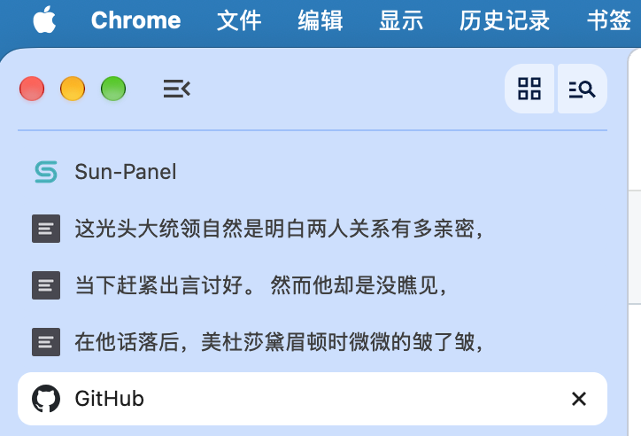

# thief-tab


把导入的 TXT / EPUB 文本按页写进浏览器**标签页标题**（`document.title`），配合浏览器的**垂直标签页**当侧边摸鱼阅读栏：标签页标题实时显示当前页正文，数字键全站翻页，老板键一键把标题伪装成「新标签页」。支持**最多 3 个速记页联动**——标签栏里并排显示连续的三"行"，任意一处翻页整组同步，像多行小字幕一样阅读。

实际效果（垂直标签栏里并排三行速记页）：



> 名字里的 "thief" 即「偷看」：正文藏在标签页标题里，与藏进系统任务栏的桌面工具 [Thief-Book](https://thief.im) 是同一个思路的浏览器版。
>
> 扩展对外名称为「Thief Tab」：扩展名、描述、页面可见文案与图标均为中性设计，不含任何敏感字样。

纯本地运行：**零网络请求、零远程代码、零第三方依赖**，无构建步骤，权限仅 `storage` + `unlimitedStorage`。content script 仅用于监听全局翻页按键并转发（约 50 行，可审计），不读取、不修改任何页面内容；安装时的「读取和更改您在所有网站上的数据」提示即来自它。

## 功能一览

- **导入**：.txt（UTF-8 严格解码失败自动回退 GB18030，可手动指定 UTF-8 / GBK / GB18030 / Big5；无 BOM UTF-16 自动识别）与 .epub（零依赖解析器，含解压炸弹防护、ZIP64 占位与文件名编码容错），单文件 ≤ 50MB，点击或拖入多选，**同文件按字节哈希判重跳过**
- **书架与进度**：书名 + 进度百分比，点击即读，可删除；正文存 IndexedDB，元数据与进度存 `chrome.storage.local`，全部只在本机，重开速记页自动恢复上次的书和页码
- **分页**：按字数（8–60 可调，默认 16），断点优先落在标点之后，代理对不切开
- **翻页**：速记页内 ← / →；任何 http/https 网页按数字 4 / 6（主键盘与小键盘均可、NumLock 任意、输入框内不劫持）；键位可录键自定义，改键网页端即时生效；**翻页方式可选**——整体翻页（多标签整组一起翻，默认）或逐行翻页（一次一行）
- **多标签联动**：最多 3 个速记页，按标签栏顺序各显示连续一页；翻页按组内行数**整体翻页**（3 个标签一次翻过整个三行窗口）；翻页 / 搜索跳转 / 切书 / 设置变更 / 伪装切换整组同步；关闭自动重排补位，超员第 4 个提示并自毁；对冻结（休眠）标签页有超时换人与幂等保护
- **伪装**：老板键 Alt+Q（可改键）或 Esc 全组切换；伪装标题默认「新标签页」可自定义，另可开启标题前缀伪装；伪装态隐藏全部页面内容、冻结搜索与翻页、图标回默认中性灰
- **搜索**：全部匹配计数（超过 2000 条显示 `N/2000+`）、回车 / Shift+回车循环跳转、标签页标题同步跳转、跨页匹配钳制高亮
- **目录（章节跳转）**：识别「第X章/节/回/卷」「序章/楔子/尾声/后记/番外」等标题行，点「目录」列出全部章节与所在页码，点击即跳；进度栏显示「第 X/Y 章」；伪装时目录收起（启发式识别，非常规样式可能漏识别，不影响正文与分页）
- **标签位图标**：第 1 / 2 / 3 个标签位独立配置（上传图片 ≤2MB / 输入网址「获取」/ 清除），按行序应用，重排自动跟随，伪装态全部回中性灰

## 安装（Chrome / Edge，本地 unpacked）

1. 下载本仓库，把其中的 `thief-tab/` 文件夹整个放到一个**固定位置**（文件夹路径决定扩展 ID，移动后 ID 会变）。
2. 打开 `chrome://extensions`（Edge 为 `edge://extensions`），开启**开发者模式**（Chrome 右上角 / Edge 左侧）。
3. 点「加载已解压的扩展程序」，选择 `thief-tab` 文件夹；建议把「Thief Tab」固定到工具栏。
4. **升级 / 重载扩展后，已打开的网页需要刷新（F5）一次**，全局翻页与老板键才会在那些页面生效（浏览器不会自动向旧页面注入；未刷新页面按键失败时会在 Console 打出刷新提示）。

### 开启垂直标签页（侧边阅读栏的关键）

- **Edge**：点工具栏「垂直标签页」按钮，或右键标签栏空白处勾选。
- **Chrome**：较新版本点标签栏右端「搜索标签页 ▾」，在弹出菜单开启「垂直标签页」；没有该入口可改用 Edge。

开启后速记页标签窄条排列在窗口左侧，标题即正文，侧边栏阅读效果最佳。

### 防止标签页休眠导致标题停更（重要）

Edge「睡眠标签页」与 Chrome「内存节省程序」会冻结后台标签页，导致全局键与标题刷新失效。**将速记页标签固定（pin）即可豁免**：右键速记页标签 →「固定」；已被冻结的切回即自动唤醒。

### 设为浏览器启动页（开机自动恢复）

1. `chrome://extensions` → 本扩展「详情」里复制 **ID**。
2. 浏览器设置 →「启动时」→「打开特定网页或一组网页」→ 添加 `chrome-extension://<扩展ID>/reader.html`，启动即自动打开速记页并恢复进度。

## 快捷键一览（均可在设置页录制修改）

| 快捷键 | 作用 | 生效范围 |
|---|---|---|
| ← / → | 上一页 / 下一页 | 速记页获得焦点时 |
| 数字 4 / 6（**可自定义**） | 上一页 / 下一页（整组联动） | 所有 http/https 网页 |
| 老板键（默认 Alt+Q，**可自定义**） | 切换标题伪装（整组） | 所有 http/https 网页 + 速记页内 |
| Esc | 切换标题伪装（整组） | 速记页内 |

全局翻页与老板键通过 content script 注入实现：**浏览器内部页面（chrome://、新标签页、网上应用店）与 PDF 查看器无法注入，不生效**；网页输入框内按键不触发翻页；有数字快捷键的网站（如 YouTube 进度跳转）会被翻页优先接管。改键后网页端即时生效，上下页不能绑同一个键；macOS 上老板键的 Alt 即 Option 键。

## 数据与隐私

正文、持久化分页、章节索引存 IndexedDB，书元数据 / 进度 / 设置存 `chrome.storage.local`，全部只在本机；扩展重载、浏览器重启数据均保留，**移除扩展会清空全部数据**（先自行备份原文件）。除「网址图标」由浏览器按需加载你填写的图片地址外全程无网络请求，可在开发者工具 Network 面板复核。

## 已知限制

- 浏览器内部页面（chrome://、新标签页、网上应用店）与 PDF 查看器无法注入，全局翻页与老板键在这些页面不生效。
- 伪装态冻结翻页与搜索（防止标题与真实进度分叉的设计取舍），Esc / 老板键恢复后继续。
- EPUB 仅提取文本（图片 / 样式忽略），不支持 DRM 加密书籍与完整 ZIP64 超大容器。
- 50MB 级大书首次导入或改页大小有约 0.3–1 秒重排卡顿（分页已持久化，重开秒开）。
- 章节识别为启发式（行首「第X章/卷」等、≤20 字），非常规样式可能漏识别，不影响正文与分页。

## 目录结构

```
thief-tab/
├── thief-tab/                 扩展本体（整个文件夹「加载已解压」即可安装）
│   ├── manifest.json          MV3，权限仅 storage + unlimitedStorage
│   ├── reader.html / .css / .js   速记页（书架 / 阅读+搜索+目录 / 设置）
│   ├── keys.js                键位逻辑共享模块
│   ├── content.js             网页注入：翻页与老板键转发（仅监听按键）
│   ├── epub.js                零依赖 EPUB 解析（解压上限、ZIP64、编码别名容错）
│   ├── background.js          工具栏打开/聚焦、消息转发与联动组成员表管理
│   └── icons/icon128.png      中性灰色几何图形
├── .github/workflows/         push v* tag 自动构建 Release（zip + crx）
├── screenshot-tabs.png        标签栏三行联动效果截图
├── LICENSE                    MIT
└── README.md
```

## AI 披露（vibe coding）

本项目是**纯 vibe coding 产物**：全部代码由 AI 编码代理在「作者提需求 → 看结果 → 定验收」的循环中写成，人类不直接手写代码，负责方向决策、验收标准与测试用例的钉死。

质量不靠「相信 AI」：30 项单元测试 + 125 项真实 Chromium E2E 全量回归（覆盖导入 / 翻页 / 多标签联动 / 伪装 / 安全审计），加上全仓零 npm 依赖、零构建步骤——每个文件都可以整篇读完再决定要不要用。

MIT 协议按「现状」提供，AI 写的代码也不例外，请自担风险。

## 协议

[MIT](LICENSE) © 2026 dangzhao
